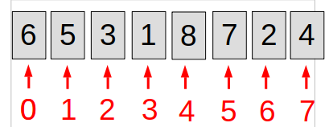

# Tri par Bulles 

Tout d'abord, commençons par le commencement. Imaginons que nous ayons huits cartes, allant de 1 à 8. Ces cartes sont positionnés de façon aléatoire dans un tableau.

Nous avons 8 cartes mais nous allons commencer par l'index 0. Ainsi, dans cet exemple, nous ne dirons pas _"carte 6"_ mais plutôt _"index 0"_. Nous aurons donc 7 index.

Il faut savoir que l'index 0 peut se trouver aussi bien à gauche qu'à droite. Tout dépend où vous souhaitez démarrer. Dans cet exemple, cependant, l'ordre de lecture sera de gauche à droite.

Il y as plusieurs choses à savoir :

* Il faut toujours comparer deux valeurs entre elles.
* Comme nous commençons par la gauche, il faudra comparer avec la valeur à gauche.
* L'index 0 ne pouvant se comparer à lui-même, on doit donc "next" et passer à l'index 1.
* Il faut se poser cette question : **Est-ce que l'index X est-il supérieur à l'index Y ?**
* Deux choix s'offrent alors à nous. Si la réponse est **"oui"**, nous devons changer de place les deux index. NOus continuerons alors notre lancée. Si cependant, la réponse est **"non"**, les index restent à la même place et on _"next"_. On passe à l'autre index.

Par exemple : 

1. Nous commençons par l'index 0. Ne pouvant se comparer à lui-même, on **next**.
2. Nous comparons l'index 1 à l'index 0 en se posant la question : **"Est-ce que l'index 1 est-il supérieur à l'index 0 ?"** 
3. Nous nous rendons compte que la réponse est non. Nous laissons alors l'index 1 à sa place. 
4. On "next" et on passe au prochain index. 
5. Nous posons toujours la même question jusqu'à arriver à l'index 7. 
6. Une fois l'index 7 placés, nous repassons à l'index 0 et ainsi de suite.
7. A la fin, le tableau sera classé par ordre croissant. La plus grande valeur étant à la fin. 

Ce gif vous aideras à comprendre plus facilement le mouvement de tri. 